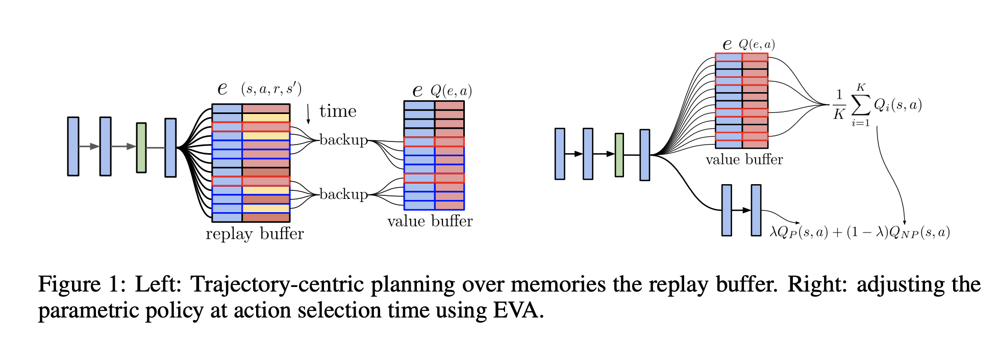
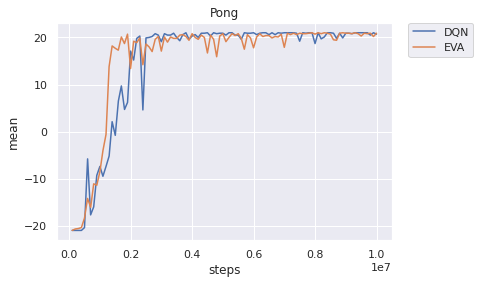
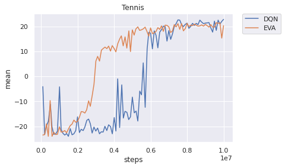
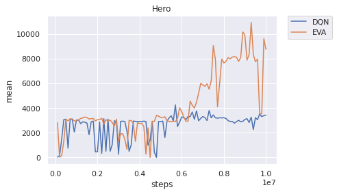

# Ephemeral Value Adjustments based on pfrl

- from https://arxiv.org/abs/1810.08163

I implemented an algorithm called Ephemeral Value Adjustments (EVA) using [pfrl](https://github.com/pfnet/pfrl).

[Japanese README](./README_JP.md)

## EVA
- [Fast deep reinforcement learning using online adjustments from the past](https://arxiv.org/abs/1810.08163)

## Requirement
- python >= 3.8
    - pfrl
    - OpenAI gym
        - atari-py >= 0.2.6 

## Usage
    python train.py [options]
### Options
- `--env` : Environment name of the Atari.
    - Eg : `--env PongNoFrameskip-v4`
- `--gpu` : If 0, use the GPU. If the number is less than 0, the GPU is not used.
- `--agent` : Choose DQN and EVA.

## TODO
- [ ] Reduce GPU memory usage
- [ ] More experiments.

## Performance Comparison
 
